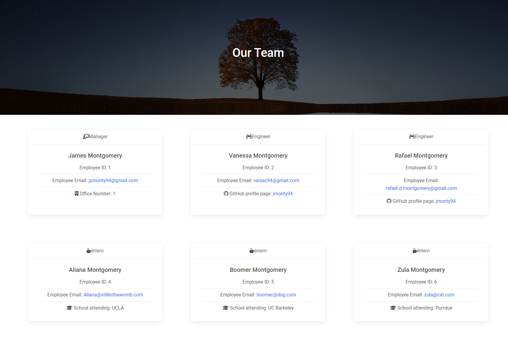

# A CLASSy Employee Directory Generator
​
## Table of Contents
​
- [Overview](#overview)
  - [The challenge](#the-challenge)
  - [User Story](#user-story)
  - [Acceptance Criteria](#acceptance-criteria)
  - [Screenshot](#screenshots)
  - [Link to Live Demo](#links)
- [My process](#my-process)
  - [Built with](#built-with)
  - [What I learned](#what-I-learned)
  - [Continued development](#continued-development)
  - [Useful resources](#useful-resources)
- [Author](#author)
- [Acknowledgments](#acknowledgments)
​
## Overview
​
### The challenge
​

​
### User Story
​
```
AS A manager
I WANT to generate a webpage that displays my team's basic info
SO THAT I have quick access to their emails and GitHub profiles
```
​
### Acceptance Criteria
​
```
GIVEN a command-line application that accepts user input
WHEN I am prompted for my team members and their information
THEN an HTML file is generated that displays a nicely formatted team roster based on user input
WHEN I click on an email address in the HTML
THEN my default email program opens and populates the TO field of the email with the address
WHEN I click on the GitHub username
THEN that GitHub profile opens in a new tab
WHEN I start the application
THEN I am prompted to enter the team manager’s name, employee ID, email address, and office number
WHEN I enter the team manager’s name, employee ID, email address, and office number
THEN I am presented with a menu with the option to add an engineer or an intern or to finish building my team
WHEN I select the engineer option
THEN I am prompted to enter the engineer’s name, ID, email, and GitHub username, and I am taken back to the menu
WHEN I select the intern option
THEN I am prompted to enter the intern’s name, ID, email, and school, and I am taken back to the menu
WHEN I decide to finish building my team
THEN I exit the application, and the HTML is generated
```

### Screenshots
​
#### Example of Generated Page



### Links
​
[Live Demo](https://drive.google.com/file/d/1JT_ZndsGCzcW6UN7KYtMfUYF40-Yzb9V/view)

[Page Generated in Demo](./dist/index.html)
​
## My process
​
### Built with
​
- NodeJS
- Inquirer
- Jest
- Babel
- MDBootstrap
​
### What I learned
​
This project came with a bit of a curve ball trying to make everything work with ES6 due to installing the latest version of Inquirer. I was determined to make it work and found out how to make Jest and all of the different import and exports work by adjusting the package.json and installing Babel.
​
### Continued development
​
Honestly pretty satisfied with this result and don't think I will need or want to revisit later
​
### Useful resources
​
- [w3Schools](https://www.w3schools.com/) - Resource with great examples and navigation between different functionality
- [MDN Web Docs](https://developer.mozilla.org/en-US/docs/Learn/JavaScript) - In-depth documentation for elements or functions
- [stackoverflow](https://stackoverflow.com/) - Answered specific questions from various collaborators
- [MD Bootstrap](https://mdbootstrap.com/) - Easy to use framework that can be molded to our application needs


## Author
​
- Website - [James Montgomery](https://jmonty94.github.io/portfolio/)

## Acknowledgments
​
Thank you to Luigi Campbell my TA who helped me with making my tests more unit based to allow for better troubleshooting down the line.